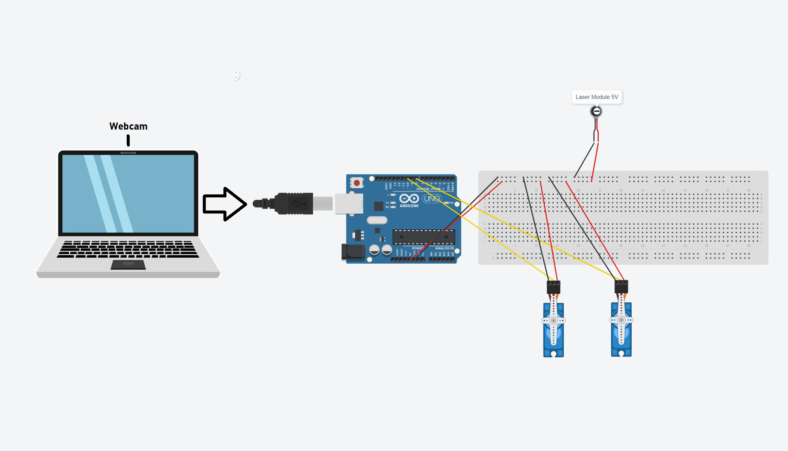

# AT things individual project

## Mos Daniele 935

## Name: ****Face Tracking Laser Turret****

## Description:

The main idea of the project is to use OpenCV in Python to detect faces from the video stream (in our case the video stream will come from web cam or smartphone) and it will approximate a point at the center of the face. Face detection will be done using a pre-trained model that performs really well and works with the OpenCV library.

Using Arduino as our microcontroller we will use it together with 2 servos (for axes x and y). The laser on top will hold a laser module. The 2 servo motors will be connected to the Arduino UNO board through a breadboard.

We will be using the coordinates of the detected face that we got using OpenCV library will be translated in coordinates for the Arduino board. We than make use of the 2 servos and direct them in order to point the laser module at the face where we detected and calculated the target point.

## **Setup and Build:**

- Need to glue down the X axis servo and on top of it, glue the second stepper (Y axis) horisontly. Also glue the laser module at the end of the Y axis stepper. Make sure the X axis one is glued to something stable so it won't rumble around.
- After we assemble the circuits and write the arduino program and transfer it to the arduino board, we need to power up the circuit.
- Make sure that the Arduino is running correctly and keep in mid the serial port selected in the Arduino IDE, it should be the same as in the “face_detection.py” file

## Hardware requirements:

- Arduino UNO board ([https://store.arduino.cc/products/arduino-uno-rev3](https://store.arduino.cc/products/arduino-uno-rev3))
- 2 X ****Micro Servomotor SG90 90° (****[https://www.optimusdigital.ro/ro/motoare-servomotoare/26-micro-servomotor-sg90.html](https://www.optimusdigital.ro/ro/motoare-servomotoare/26-micro-servomotor-sg90.html)****)****
- Web cam (laptop web cam, mine is **Realtek Integrated Camera 720p**)
- Computer (it runs the python program and reads the serial data from Arduino, mine is a Thinkpad T470s)
- Breadboard with 400 points ([https://cleste.ro/breadboard-400-puncte.html](https://cleste.ro/breadboard-400-puncte.html))
- Laser module - red laser 5V (Can also work with a generic laser) ([https://www.optimusdigital.ro/ro/optoelectronice-laser/605-modul-dioda-laser.html](https://www.optimusdigital.ro/ro/optoelectronice-laser/605-modul-dioda-laser.html))
- Wires ([https://www.optimusdigital.ro/ro/fire-fire-mufate/12-set-de-cabluri-pentru-breadboard.html?search_query=cabluri&results=678](https://www.optimusdigital.ro/ro/fire-fire-mufate/12-set-de-cabluri-pentru-breadboard.html?search_query=cabluri&results=678))

## Running:

- Inject the Arduino program into the board, by hitting Verify button and then the Upload one. Make sure it has been uploaded successfully.

- After we follow the step above, we can start the python “main.py” program, which will present us with the video stream from the webcam, with the detection drawn on top.
- In order to exit the program we press the “Esc” button and the video stream will stop.

## Schematic:

